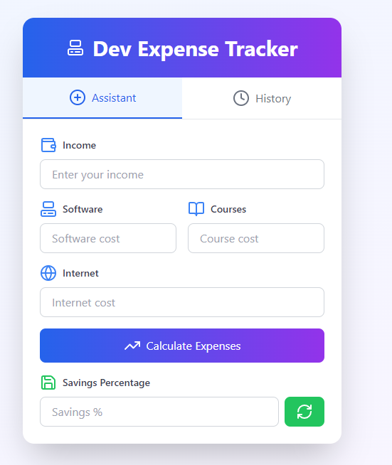
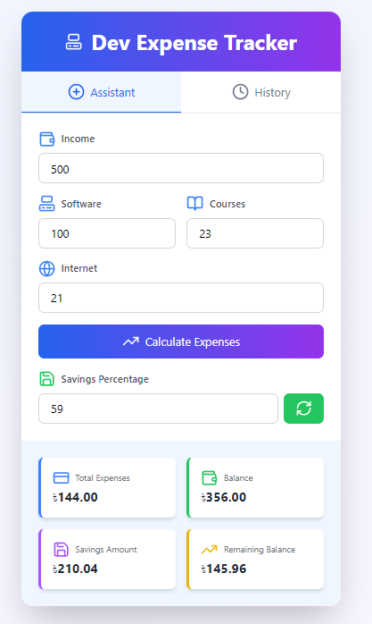
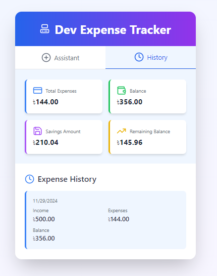

# DevExpenseTracker

DevExpenseTracker is a modern, web-based expense tracker designed specifically for programmers to easily manage their daily expenses. With an intuitive and responsive user interface built using React and Tailwind CSS, it allows users to add items, input prices, and calculate total expenses in real-time.

## Key Features

### 1. **Modern, Responsive Design**
   - Gradient backgrounds for a sleek look
   - Improved typography for better readability
   - A responsive layout that adjusts to various screen sizes

### 2. **State Management**
   - Utilizes React's state management for a dynamic user experience
   - Real-time expense calculation
   - Instant form validation and dynamic error handling for better UX

### 3. **Enhanced UI/UX**
   - Integration of Lucide React icons for a visually engaging interface
   - Improved form inputs with clear labels and validation feedback
   - Simple and easy-to-use interface designed for quick interactions

## Demo

You can view a live demo of DevExpenseTracker [here](#)

## Technologies Used
- **React** – For building the user interface and managing the state.
- **Tailwind CSS** – For utility-first CSS styling and responsiveness.
- **Lucide React** – For adding customizable icons to improve visual appeal.

## Setup Instructions

### Prerequisites
- [Node.js](https://nodejs.org/) (v14 or higher)
- [npm](https://www.npmjs.com/) (Node Package Manager)

### Installation Steps

1. Clone the repository to your local machine:
   ```bash
   git clone https://github.com/NajibHossain49/Dev-Expense-Tracker.git
   ```

2. Navigate to the project directory:
   ```bash
   cd Dev Expense Tracker
   ```

3. Install the necessary dependencies:
   ```bash
   npm install
   ```

4. Start the development server:
   ```bash
   npm run dev
   ```

5. Open your browser and navigate to `http://localhost:5173/` to see the app in action.

## Usage

- **Add Expense:** Enter the item name and price in the respective fields, and click "Add Expense" to record it.
- **Total Calculation:** The total expense is calculated dynamically as you add new items.
- **Validation & Error Handling:** The app provides real-time validation for item name and price fields, ensuring the entries are correct.
- **Clear Form:** You can easily reset the form to start adding new expenses.

## Screenshots

Here are some screenshots of the DevExpenseTracker app:






## Contributing

1. Fork the repository.
2. Create a new branch (`git checkout -b feature-name`).
3. Make your changes and commit them (`git commit -am 'Add new feature'`).
4. Push to your branch (`git push origin feature-name`).
5. Create a new pull request.
